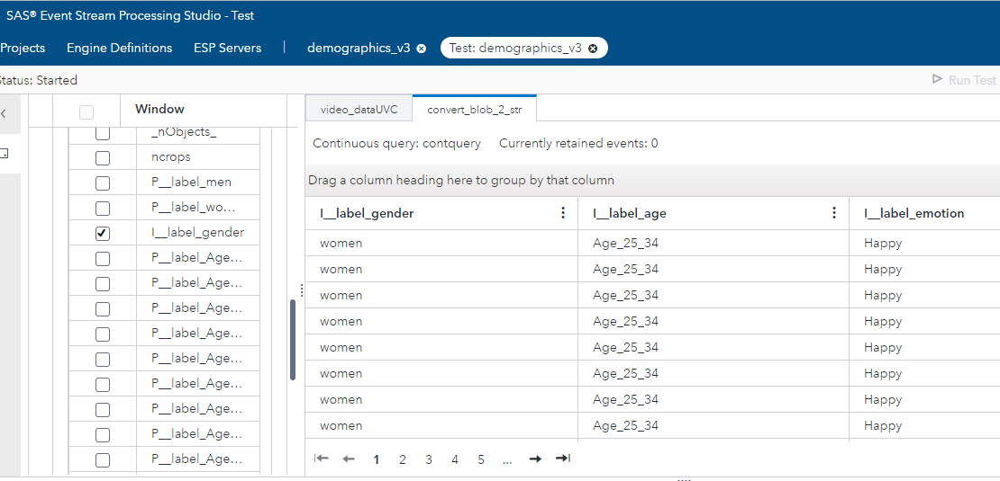

# Demographic Image Analysis

    

In this repository, you'll see how streaming image data is transformed or enhanced in real-time to deliver demographic data.

## Overview

This repository will show you how to use two of the products found in SAS Analytics for IoT to train and build a demographic detector which may be used in a retail setting.  

  * [SAS Visual Data Mining and Machine Learning](https://www.sas.com/en_us/software/visual-data-mining-machine-learning.html)
  * [SAS Event Stream Processing](https://www.sas.com/en_us/software/event-stream-processing.html)

These two products provide the tools needed when training, testing and running computer vision models.  This repository will cover the following topics: 

  *  Define the use case for our retail example
  *  Gathering and displaying demographic data
  *  Learn the basics of computer vision
  *  Learn how to train CV models using the SAS Deep Learning Python (DLPY) package
  *  How to operationalize our models using streaming analytics
  

## Use Case

Imagine you are the owner of a retail store and want to better understand your customers.  Wouldn't it be great to know what percentage of customers in your store looked happy as they browsed your shelves, or perhaps which underage customers are trying to buy cigarettes?  Applications of machine learning, computer vision (CV) and streaming analytics abound, covering use cases from enhancing real time in-store customer experience, to grid surveillance and security, predictive maintenance, claims fraud management and improved manufacturing quality. Retail intelligence can be enhanced by gathering and displaying demographic data and [SAS Analytics for IoT](https://www.sas.com/en_us/software/analytics-iot.html) is a perfect solution to solve this or any [computer vision](https://www.sas.com/en_us/insights/analytics/computer-vision.html) problem.  This comprehensive AI-embedded solution provides so many capabilities because it integrates a number of key SAS products (see the figure below).

## Gathering and displaying demographic data: a retail example

Using two products that are embedded in the SAS Analytics for IoT solution, [SAS Visual Data Mining and Machine Learning](https://www.sas.com/en_us/software/visual-data-mining-machine-learning.html) (VDMML) and [SAS Event Stream Processing](https://www.sas.com/en_us/software/event-stream-processing.html) (ESP), I’m going to show you how to train and deploy various demographic analytic models to create a single solution that connects directly to a USB-connected security camera.  With this connection, I can process incoming images using pre-training analytical models and produce demographic statistics.  This application provides:

* Face Detection - Process incoming images and detect human faces in the video stream
* Age Classification - Determine approximate age grouped by category
* Gender Classification - Determine male or female
* Emotion Classification - Group by these classes:  Happy, Neutral, Sad, Fear, Surprise, Angry
 
An example sample user interface might look like this:

On the left, I’m showing the demographics as it relates to the current face detected in the security camera video feed in real time.  On the right, I have an example of the total gender statics for that day.  Now let’s talk about the steps you’ll need to build this type of solution yourself.

## First off, let's talk computer vision

Computer vision (CV) techniques provide the ability to acquire, process and analyze incoming images.  This analysis produces numerical results in the form of predictions based on the classes we define.  In this example, we need to create four separate CV models.  First, we need an object detection model which will not only give us the probability there is a human face in the incoming image, but it will also give us the coordinates of that face in the image, in the form of a bounding box.  Using the box coordinates we can then crop just the face from the incoming image and send that data to the next analytical model.  Consider this example:

Here I’m using a YOLO (You Only Look Once) [object detection model](https://blogs.sas.com/content/subconsciousmusings/2019/03/21/building-a-yolo-object-detection-model-using-sas/) to find all the human faces in the incoming video stream.

## Next, we train our models

Before I can build an application that uses analytical models to predict outcomes, we need to train them.  The training process for CV involves classifying images and separating these images into datasets that can then be fed into a [machine learning](https://www.sas.com/en_us/insights/analytics/machine-learning.html) model such as ResNet50, VGG16, Darknet etc.  This stage of the process is completed using the [SAS Deep Learning Python (DLPy)](https://github.com/sassoftware/python-dlpy) package which provides the high-level **Python APIs** to the deep learning methods in **SAS Visual Data Mining and Machine Learning** (VDMML).

As the previous diagram illustrates, four separate datasets were created to support model training.

Because I needed to tweak each dataset to get the best possible output, each image dataset supports the training of one model.
Face detection was trained using a Yolo V2 architecture while age, gender and emotions were trained using a ResNet50 architecture.
For example, when training the gender model, image data is loaded into SAS Viya and VDMML using DLPy.
Deep learning algorithms are then invoked as each image is processed to create a portable analytics file called an ASTORE file.
VDMML is GPU-enabled so that training times are greatly improved.  A typical training exercise contains these steps:

* Setup libraries and launch CAS
* Load and explore the training data
* Prepare the data for modeling
* Specify the model architecture, configure model parameters and import pre-trained weights
* Fit the image detection and classification model
* Evaluate the newly created image classification model
* Visualize model results
* Save model as ASTORE for deployment

Please see the "training" directory of this project for examples of the Jupyter notebooks used to train the models.

## Now use streaming analytics

Streaming analytics is defined as the ability to constantly calculate statistical analytics on an incoming stream of data.  In our case, that stream of data is the images coming from the camera.  **SAS Event Stream Processing (ESP)**, which is part of the **SAS Analytics for IoT** solution, provides the ability to deploy our newly trained analytical models, in the form of ASTORE files, at the edge.  With ESP you can ingest, filter and transform your data in stream.  I like to think of it as enabling business rules to gain extra business value.  For example, let's say your company wanted to track how many happy women between the ages of 10 and 30 walked by the frozen food section on Tuesday when you were running a sale, verses a normal day when the sale is not running.   **ESP** gives you the capability to make that happen.  There is a saying here at SAS, "Without deployment, analytics is only a science experiment."

This diagram illustrates an overview of this project deployment architecture.

Here we can see the flow of information through the system and highlight some key points:

* **ESP is built for speed.** Although, there are many methods of ingesting data into ESP (REST, MQTT, MQ), to make this superfast I used a UVC connector which allows me to directly connect ESP to the incoming video stream from the camera.  I also took advantage of ESP's multithreaded capability by scoring age, gender and emotion simultaneously each in its own thread. 
* **ESP integrates with open source.** You can easily call python scripts in stream from the ESP model flow.  This allows further integration with other open source packages such as OpenCV.  Using Python and OpenCV, the images were cropped, resized, reshaped and colors were manipulated.  Anything is possible. 
* **Retention is amazing.** Retention defines a group of events over a time or event count.  Instead of doing analytics on each image individually, you can now take a group of images and create new event data – like the number of men over the last hour or total number of kids today.  It is very powerful.
* **ESP** includes a powerful graphical development platform. Using **ESP Studio** models such as these may be created without any coding.  For example, publishing my results to MQTT is as easy as dragging a window onto the canvas and filling out an MQTT specifications form. 

**As you can see, SAS Analytics for IoT** provides you with all the tools you’ll need to quickly go from concept to production.  Although this example consumed image data, you can use any type of data.  This comprehensive solution also provides tools to maintain and govern model development, as well as everything you need to visualize and cleanse new data sources.   Let’s see where your imagination takes you!  I’d love to hear how you put SAS Analytics for IoT to work for your company.

### Prerequisites

List of required software offered as part of [SAS Analytics for IoT](https://www.sas.com/en_us/software/analytics-iot.html)
 
**Training**   
   * [SAS Visual Data Mining and Machine Learning](https://www.sas.com/en_us/software/visual-data-mining-machine-learning.html)
   * [SAS Scripting Wrapper for Analytics Transfer](https://sassoftware.github.io/python-swat/)
   * [SAS Deep Learning Python Interface](https://sassoftware.github.io/python-dlpy/)
   
**Streaming**   
   * [SAS Event Stream Processing](https://www.sas.com/en_us/software/event-stream-processing.html)
   * A USB connected webcam
   

### Installation

This accelerator assumes you have access to an Analytics for IoT installation.  This includes SAS Event Stream Processing and VDMML.  

## Training

Model training is optional for this accelerator since the pre-trained .astore files have been provided.  However, contained in the training directory of this repository are the Jupyter notebooks which were used during the demographic model training. Please refer to these notebooks in order to learn how to train your own computer vision analytic models.  Please refer to the following for details: 

  * [Age training example](./training/Age.ipynb)
  * [Emotions training example](./training/Emotions.ipynb)
  * [Gender training example](./training/Gender.ipynb)

It is recommended that no less than 1000 images be used for each class you intend to train and more images are always better.  For example, each age group or emotion class should contain no less than 1000 images.  These images are also subdivided into two datasets.  The first is for training and the second is a testing dataset.  Therefore, an additional 200 images for testing is also recommended.  Image size should be no less than 224 by 224 pixels.  Image databases such as [Open Image](https://storage.googleapis.com/openimages/web/index.html) are a great place to start.      

For more information about the DLPy high-level Python APIs which allows you to build deep learning models please see the following examples:
  *  [Image Classification](https://github.com/sassoftware/python-dlpy/tree/master/examples/image_classification)
  *  [Object Detection](https://github.com/sassoftware/python-dlpy/tree/master/examples/object_detection)

### Running

Building your own demographic detector involves downloading the files from the ./streaming directory of this repository to your Event Stream Processing or ESP machine.  These files include: 

  * Age.astore - CNN model which detects age 
  * Emotion.astore - CNN model which detects emotions
  * Gender.astore -  CNN model which determines gender
  * faceDetection.Tiny-Yolo2.416.v1.astore - Object detection model which locates human faces in images
  * crop.py - Python script used for image processing 
  * demographics_GA.xml - ESP flow descriptor file  

Once downloaded please note the location of the files.  The demographics_GA.xml must be edited and the paths to the downloaded files must be updated to match your installation.  To aide the editing process I have included the following comment in each location that needs updating:  
  * "Please update here"
  
This ESP flow also connects to the USB connected webcam which is directly attached to the machine which is running ESP.  By default, the hardware is located at /dev/video0.  If your installation differs please adjust the "uvc" connector parameters to match your installation.  

Next, start ESP and load the edited demographics_GA.xml file.  This will load the 4 analytical models, connect the the webcam and start processing streaming images.  Results, are published to an MQTT topic named "demographics" on the localhost machine or can be viewed using ESP Studio Dashboard.  ESP Studio provides a graphic interface where streaming flows are developed.  The following diagram depicts the flow which is running our streaming model.  

As you can see the model is very readable and intuitive.  Data flows in from the top blue box which represents our connection to the camera.
From there the image is resized and passed to our first algorithm which detects human faces.  The cropfaces window shows ESP's seamless python integration.  The cropped face image is then passed to our three demographic computer vision models.  Since each of these models runs in parallel the results must be merged back together.  This happens in the union window called MergeResults. 

For an example let's consider the following image. 

This is the image which is currently being presented to our camera.  The red line represents the detection area which is generated by our first analytical model.
Our ESP flow uses these coordinates to crop the face and send an updated image to the downstream demographics models.
In the introductory video I showed how an application can be written which can consume data from ESP and presented to a user.
It is also possilbe to view the raw ESP project results using SAS ESP Studio.
ESP provides the ability to subscribe to a project window.  This streams the window results based on the schema for that window.
We can look a the results using SAS ESP Studio.
Here we are using ESP Studio to show the results for three of the items found in the convert_blob_2_str window schema.

Here you can see our models predict that Betty is happy, a woman and between 25 and 34 years old. 

## Contributing

This repository is not open for external contributions.

## License

This project is licensed under the [Apache 2.0 License](LICENSE).

## Additional Resources

Additional resources might include the following:

* [SAS Analytics for IoT](https://www.sas.com/en_us/software/analytics-iot.html)
* [SAS Visual Data Mining and Machine Learning](https://www.sas.com/en_us/software/visual-data-mining-machine-learning.html)
* [SAS Event Stream Processing](https://www.sas.com/en_us/software/event-stream-processing.html)
* [SAS for Developers](https://developer.sas.com/home.html)
* [SAS Deep Learning Python Interface](https://sassoftware.github.io/python-dlpy/)
* [SAS Scripting Wrapper for Analytics Transfer](https://sassoftware.github.io/python-swat/)
* [SAS Communities](https://communities.sas.com/)

