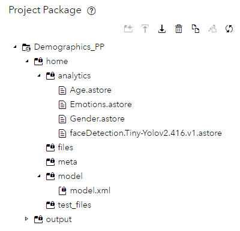

# Demographic Image Analysis

   

In this repository, you'll see how to connect to an RTSP stream of image data is transformed or enhanced in real-time to deliver demographic data.

[TOC]

## Overview

This repository will show you how to use two of the products found in SAS Analytics for IoT to train and build a demographic detector which may be used in a retail setting.  

  * [SAS Visual Data Mining and Machine Learning](https://www.sas.com/en_us/software/visual-data-mining-machine-learning.html)
  * [SAS Event Stream Processing](https://www.sas.com/en_us/software/event-stream-processing.html)

These two products provide the tools needed when training, testing and running computer vision models.  This repository will cover the following topics: 

  *  Define the use case for our retail example
  *  Gathering and displaying demographic data, using object detection and image recognition 
  *  Learn the basics of computer vision
  *  Learn how to train CV models using the SAS Deep Learning Python (DLPY) package
  *  How to deploy the trained CV models using SAS ESP 
  *  How to present the demographic data effectively using a Grafana dashboard


## Use Case

As the proprietor of a retail establishment, envision gaining a  better understand your customers. Imagine gaining insights into the emotional engagement of customers as they explore your store—knowing the demographic preferences for specific store aisles, distinguishing between male and female customer attractions. Wouldn't that be invaluable?  Using computer vision and streaming analytics it is possible to do this in real-time.  All that's required is a camera connected through RTSP, complemented by an object detection model pinpointing human faces, alongside image recognition models discerning additional details. The outcomes are gathered and channeled into a dashboard, enabling real-time analysis.


## Gathering and displaying demographic data: a retail example

Using two products that are embedded in the SAS Analytics for IoT solution, [SAS Visual Data Mining and Machine Learning](https://www.sas.com/en_us/software/visual-data-mining-machine-learning.html) (VDMML) and [SAS Event Stream Processing](https://www.sas.com/en_us/software/event-stream-processing.html) (ESP),  let's explain how to train and deploy various demographic analytic models to create a single solution that connects directly to an RTSP connected security camera. Through this connection, processing incoming images using pre-training analytical models produce demographic statistics. 

The following models will need to be trained for this use case:

* Face Detection - Process incoming images and detect human faces in the video stream
* Age Classification - Determine approximate age grouped by category
* Gender Classification - Determine male or female
* Emotion Classification - Group by these classes:  Happy, Neutral, Sad, Fear, Surprise, Angry

The example Grafana dashboard looks as follows:


There are various graphs displaying demographic statistics for the last 100 observations as well as a live video stream which shows the current face that has been detected via the RTSP stream.  The image has been augmented to show the current results from the scoring algorithms. 

## First off, let's talk computer vision

Computer vision (CV) techniques provide the ability to acquire, process and analyze incoming images.  This analysis produces numerical results in the form of predictions based on the classes we define.  In this example, we need to create four separate CV models.  First, we need an object detection model which will not only give us the probability there is a human face in the incoming image, but it will also give us the coordinates of that face in the image, in the form of a bounding box.  Using the box coordinates we can then crop just the face from the incoming image and send that data to the next analytical model.  Consider this example:


Here I’m using a YOLO (You Only Look Once) [object detection model](https://blogs.sas.com/content/subconsciousmusings/2019/03/21/building-a-yolo-object-detection-model-using-sas/) to find all the human faces in the incoming video stream.  In the case of multiple faces being detected, multiple cropped faces are passed to the downstream models as separate events.  

## Next, we train our models

Before I can build an application that uses analytical models to predict outcomes, we need to train them.  The training process for CV involves classifying images and separating these images into datasets that can then be fed into a [machine learning](https://www.sas.com/en_us/insights/analytics/machine-learning.html) model such as ResNet50, VGG16, Darknet etc.  This stage of the process is completed using the [SAS Deep Learning Python (DLPy)](https://github.com/sassoftware/python-dlpy) package which provides the high-level **Python APIs** to the deep learning methods in **SAS Visual Data Mining and Machine Learning** (VDMML).

	

As the previous diagram illustrates, four separate datasets were created to support model training.  Because I needed to tweak each dataset to get the best possible output, each image dataset supports the training of one model.  Face detection was trained using a Yolo V2 architecture while age, gender and emotions were trained using a ResNet50 architecture.  For example, when training the gender model, image data is loaded into SAS Viya and VDMML using DLPy.  Deep learning algorithms are then invoked as each image is processed to create a portable analytics file called an ASTORE file.  VDMML is GPU-enabled so that training times are greatly improved.  A typical training exercise contains these steps:

* Setup libraries and launch CAS
* Load and explore the training data
* Prepare the data for modeling
* Specify the model architecture, configure model parameters and import pre-trained weights
* Fit the image detection and classification model
* Evaluate the newly created image classification model
* Visualize model results
* Save model as ASTORE for deployment

## Training

Model training is optional  since the pre-trained .astore files have been provided.  However, contained in the training directory of this repository are the Jupyter notebooks which were used during the demographic model training. Please refer to these notebooks in order to learn how to train your own computer vision analytic models.  Please refer to the following for details: 

  * [Age training example](./training/Age.ipynb)
  * [Emotions training example](./training/Emotions.ipynb)
  * [Gender training example](./training/Gender.ipynb)

It is recommended that no less than 1000 images be used for each class you intend to train and more images are always better.  For example, each age group or emotion class should contain no less than 1000 images.  These images are also subdivided into two datasets.  The first is for training and the second is a testing dataset.  Therefore, an additional 200 images for testing is also recommended.  Image size should be no less than 224 by 224 pixels.  Image databases such as [Open Image](https://storage.googleapis.com/openimages/web/index.html) are a great place to start.      

For more information about the DLPy high-level Python APIs which allows you to build deep learning models please see the following examples:

  *  [Image Classification](https://github.com/sassoftware/python-dlpy/tree/master/examples/image_classification)
  *  [Object Detection](https://github.com/sassoftware/python-dlpy/tree/master/examples/object_detection)

## Now use streaming analytics

Streaming analytics is defined as the ability to constantly calculate statistical analytics on an incoming stream of data.  In our case, that stream of data is the images coming from the camera.  **SAS Event Stream Processing (ESP)**, which is part of the **SAS Analytics for IoT** solution, provides the ability to deploy our newly trained analytical models, in the form of ASTORE files, at the edge.  With ESP you can ingest, filter and transform your data in stream.  I like to think of it as enabling business rules to gain extra business value.  For example, let's say your company wanted to track how many happy women between the ages of 10 and 30 walked by the frozen food section on Tuesday when you were running a sale, verses a normal day when the sale is not running.   **ESP** gives you the capability to make that happen.  There is a saying here at SAS, "Without deployment, analytics is only a science experiment."

This diagram illustrates an overview of this project deployment architecture.


Here we can see the flow of information through the system and highlight some key points:

* **ESP is built for speed.** Although, there are many methods of ingesting data into ESP (REST, MQTT, MQ), to make this superfast I used a RTSP connector which allows me to directly connect ESP to the incoming video stream from the camera.  I also took advantage of ESP's multithreaded capability by scoring age, gender and emotion simultaneously each in its own thread. 
* **ESP integrates with open source.** You can easily call python scripts in stream from the ESP model flow.  This allows further integration with other open source packages such as OpenCV.  Using Python and OpenCV, the images were cropped, resized, reshaped and colors were manipulated.  Anything is possible. 
* **Retention is amazing.** Retention defines a group of events over a time or event count.  Instead of doing analytics on each image individually, you can now take a group of images and create new event data – like the number of men over the last hour or total number of kids today.  It is very powerful.
* **ESP** includes a powerful graphical development platform. Using **ESP Studio** models such as these may be created without any coding.  For example, ingesting images via the RTSP connector is as easy as dragging a window onto the canvas and filling out an RTSP specifications form. 
* **ESP Grafana plugin** seamlessly combines Grafana's intuitive dashboarding with ESP's versatility, offering real-time insights and dynamic visualization.


## ESP Project Detail

The ESP project is best described in phases.  

- Project package contents 
- Data ingestion 
- Analytical scoring 
- OpenCV integration using python
- Grafana plugin integration

	

As you can see the model is very readable and intuitive.  Data flows in from the top blue box which represents our connection to the video stream. From there the image is resized and passed to our first algorithm which detects human faces.  Using the ESP python window openCV is used to crop faces directly from the ESP server without using MAS or external python libraries.  The cropped face image is then passed to our three demographic computer vision models.  Model results are used to annotate the image in real time as well as calculate totals for the last 100 events coming into the project.  These totals are then sent to Grafana and our dashboard is created. 

### Project Package

Building your own demographic detector involves creating an ESP project package which includes the following trained models.

  * Age.astore - CNN model which detects age 
  * Emotion.astore - CNN model which detects emotions
  * Gender.astore -  CNN model which determines gender
  * faceDetection.Tiny-Yolo2.416.v1.astore - Object detection model which locates human faces in images

A project package is useful for organizing related content within a single package.  Once downloaded please include them in your project package as follows. It is best practice to create a project package and place your analytical models in the analytics directory.   The model reader window will use this file location to load the model.  Once the location of the ASTORE is known the XML is very straight forward.  An ESP environment variable is used to define the location.  

	

### Model Reader Window

As mentioned above the model reader window references the models stored in the project package standard locations using an ESP environment variable.   This allows for better organization and standardization.  For the age astore model the reader window would be defined as follows: 

```xml
<window-model-reader name="readagemodel" pubsub="true" model-type="astore">
  <description><![CDATA[Read model which determines age]]></description>
  <parameters>
    <properties>
      <property name="reference"><![CDATA[@ESP_PROJECT_HOME@/analytics/Age.astore]]></property>
      <property name="usegpuesp"><![CDATA[1]]></property>
      <property name="NDEVICES"><![CDATA[1]]></property>
      <property name="DEVICE0"><![CDATA[0]]></property>
    </properties>
  </parameters>
</window-model-reader>
```

This is also where you specify GPU usage for this model.  If usegpuesp is set to 1, ESP will use the gpu when scoring this ASTORE.		

### ESP Video Capture Connector

The **SAS ESP video capture connector** is a tool that reads an input video stream and publishes each extracted image frame into a Source window as a unique event that contains a binary blob field.  It is one of the many connectors and adapters that extend SAS functionality.

Using ESP Studio configure a Source window publisher as follows:

	

  

### Analytical Scoring

ESP is configured to call 4  ASTORE models.  The first streaming analytics model performs real-time object detection, where the object is defined as a human face.  The output is mapped to the following schema.  _nObjects_ defines how many faces were found and the remaining schema entries define where in the image the object was located.  Sample of object detection schema: 

	

These values will later be used to draw bounding boxes and create new cropped images of the face which was detected.   The face image is then passed to the image classification models to determine mood, gender and age of the person.  After all the models are run, we have 3 important strings in our schema that represent the results of our efforts. 

	

The counts assigned to these labels are aggregated later in the project to generate totals, which are then visualized as graphs on the Grafana dashboard.

​	

### OpenCV Using the ESP Python Window

ESP now contains a Python window that can be used to call python directly.  Python window empowers you to craft functions within Python programs, generating SAS Event Stream Processing events.  The Python environment includes most commonly used packages including Numpy and OpenCV.   This project leverages these packages to manipulate images in the following ways:

- Cropping
- Annotating 
- Reshaping 
- Converting to greyscale
- Drawing bounding boxes

Images are passed to the Python window as BLOBs.  No B64 encoding is necessary.  This improves performance.  A handy Python code editor is also included to make things easy. 

	

As with the Lua window a function called create is called and passed the input schema in a variable called data.  A function that uses openCV call crops_draw_bboxes() is called to do just that. Crop faces out of the main image creating smaller images that can be passed to the demographic ASTOREs for scoring.  

### Grafana Plugin Setup

The new [SAS ESP grafana plugin](https://github.com/sassoftware/grafana-esp-plugin/blob/main/README.md) is a data source plugin that allows you to stream data from SAS Event Stream Processing (ESP) servers in a Kubernetes environment to Grafana dashboards With this plugin, you can visualize and monitor real-time streaming data from ESP projects and windows, and apply filters and aggregations to customize your data views. The plugin supports both ESP Pub/Sub and REST APIs, and provides a user-friendly interface to discover and select ESP servers, projects, and windows.  The plugin also enables you to use Grafana alerting and annotation features on ESP data.

First the SAS ESP plugin must be used to create a connection to the SAS ESP Studio which will be running the project.  It looks like this:

	

Simply enter the url of the ESP Studio which is running the project and save and test your connection.  When the connection is made create a Dashboard and start adding visualizations.   The visualization edit panel will include a section called data source.  Pick the data source which was created above and then select the ESP window and fields which are to be used by this visualization.

 The visualizations used above are: 

1. Base64 Image/Video/Audio/PDF
2. Bar Gauge
3. Gauge
4. Pie Chart

Here is an example of how you might configure the SAS Event Stream Processing data source for the bar gauge.  

	

Variables from the output schema of the ESP window which you are connecting to are selected.  These variables are then used to Grafana to product the graph.  


## Conclusion

**As you can see, SAS Analytics for IoT** provides you with all the tools you’ll need to quickly go from concept to production.  Although this example consumed image data, you can use any type of data.  This comprehensive solution also provides tools to maintain and govern model development, as well as everything you need to visualize and cleanse new data sources.   Let’s see where your imagination takes you!  I’d love to hear how you put SAS Analytics for IoT to work for your company.

## Prerequisites

List of required software offered as part of [SAS Analytics for IoT](https://www.sas.com/en_us/software/analytics-iot.html)

**Training**   

   * [SAS Visual Data Mining and Machine Learning](https://www.sas.com/en_us/software/visual-data-mining-machine-learning.html)
   * [SAS Scripting Wrapper for Analytics Transfer](https://sassoftware.github.io/python-swat/)
   * [SAS Deep Learning Python Interface](https://sassoftware.github.io/python-dlpy/)

**Streaming**   

   * [SAS Event Stream Processing](https://www.sas.com/en_us/software/event-stream-processing.html)
   * A RTSP stream of image data 


## Installation

This accelerator assumes you have access to an Analytics for IoT installation.  This includes SAS Event Stream Processing and VDMML.  

## Contributing

This repository is not open for external contributions.

## License

This project is licensed under the [Apache 2.0 License](LICENSE).

## Additional Resources

Additional resources might include the following:

* [SAS Analytics for IoT](https://www.sas.com/en_us/software/analytics-iot.html)
* [SAS Visual Data Mining and Machine Learning](https://www.sas.com/en_us/software/visual-data-mining-machine-learning.html)
* [SAS Event Stream Processing](https://www.sas.com/en_us/software/event-stream-processing.html)
* [SAS for Developers](https://developer.sas.com/home.html)
* [SAS Deep Learning Python Interface](https://sassoftware.github.io/python-dlpy/)
* [SAS Scripting Wrapper for Analytics Transfer](https://sassoftware.github.io/python-swat/)
* [SAS Communities](https://communities.sas.com/)

